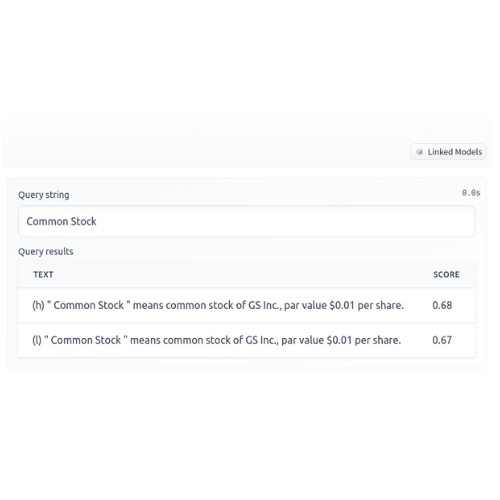
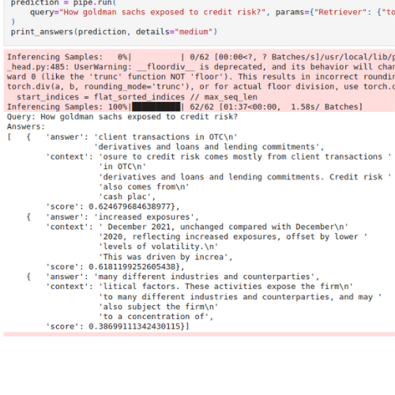

# Semantic search and Question & Answering in 10k Filings
## Motivation
This project is a demo of serach and Question and Answering on 10-k filings using transformers:
1) Semantics search using sentence transformer and 
2) Question and Answering using Haystack NLP

## Input 
Goldman Sachs 10-k filings downloaded as text file from Sagemaker Jumpstart SDK.

## Output
1) Semantic search demo can be found in hugging face space [here](https://huggingface.co/spaces/balamurugan/search-10k-filings).

2) Question and Answering output is served in notebook 
 

## Acknowledgments
1) Julien Simon HF [space](https://huggingface.co/juliensimon) and videos
2) Natural Language Processing with Transformers
3) Haystack NLP Tutorial

## Improvements
1) Training specifically on Domains
2) Adding ability to read and search or answer tables and images in addition to text

